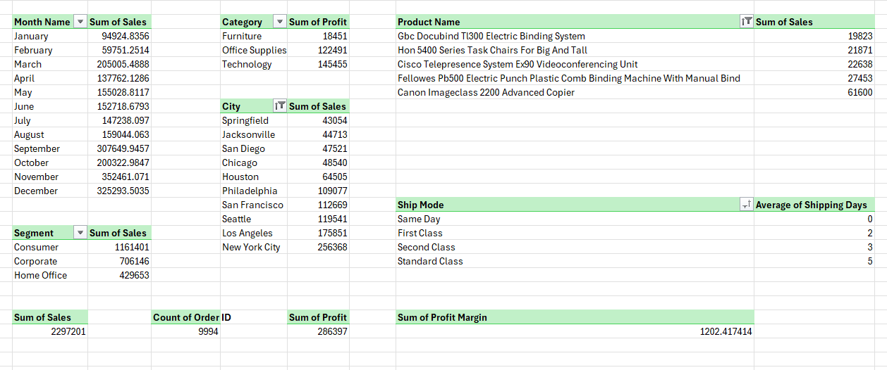

# 📊 Excel Sales Performance Dashboard

## Project Overview

This project is an interactive Sales Performance Dashboard built entirely in Microsoft Excel.

The dashboard transforms raw sales data into meaningful business insights using data cleaning, Pivot Tables, Pivot Charts, KPIs, and dynamic Slicers.

It helps stakeholders monitor sales performance, profitability, customer behavior, and regional trends in a visually appealing and interactive format.

---

##  Business Problem

Businesses generate large amounts of transactional data every day.

Analyzing this data manually is difficult and time-consuming.

This dashboard was created to answer key business questions:

- Which products generate the highest sales?
- Which categories are most profitable?
- Which regions perform best?
- How are sales changing over time?
- Which customer segments contribute most revenue?

---

## Tools & Technologies

- Microsoft Excel
- Pivot Tables
- Pivot Charts
- Slicers
- Conditional Formatting
- Excel Formulas
- Data Cleaning Techniques

---

## 📂 Project Workflow

### 1️ Data Collection

Used the Superstore Sales Dataset containing:

- Orders
- Customers
- Products
- Categories
- Sales
- Profit
- Regions

---

### 2️ Data Cleaning

Performed:

- Removed duplicate records
- Checked missing values
- Standardized date formats
- Created helper columns
- Calculated Shipping Days

---

### 3️ Data Analysis

Created Pivot Tables to analyze:

- Sales by Category
- Sales by Region
- Monthly Sales Trends
- Customer Segment Performance
- Profitability Analysis

---

### 4️ Dashboard Development

Built an interactive dashboard containing:

✅ KPI Cards

✅ Sales Analysis

✅ Profit Analysis

✅ Regional Performance

✅ Category Performance

✅ Dynamic Slicers

✅ Interactive Charts

---

##  Key Performance Indicators (KPIs)

| KPI | Description |
|------|-------------|
| Total Sales | Overall revenue generated |
| Total Profit | Net profit earned |
| Total Orders | Number of orders processed |
| Average Shipping Days | Average delivery duration |

---

##  Dashboard Preview

### Main Dashboard


---

### Data Cleaning Process


---

### Pivot Table Analysis



---

## 💡 Business Insights

- Technology category generated the highest revenue.
- Certain regions consistently outperformed others.
- Sales peaked during specific months indicating seasonal trends.
- A small number of products contributed significantly to total sales.

---

## 🎓 Skills Demonstrated

### Excel Skills

- Data Cleaning
- Data Transformation
- Pivot Tables
- Pivot Charts
- Dashboard Design
- Slicer Integration
- KPI Development

### Business Analysis Skills

- Sales Analysis
- Profitability Analysis
- Trend Analysis
- Performance Reporting
- Data Visualization

---

## 📁 Repository Structure

```text
Excel-Sales-Performance-Dashboard
│
├── Dashboard
│   └── Excel_Sales_Performance_Dashboard.xlsx
│
├── Screenshots
│   ├── Dashboard.png
│   ├── DataCleaning.png
│   └── PivotAnalysis.png
│
└── README.md
```

---

## 👨‍💻 Author

### Shaikh Sadaf Noor

AIML Engineering Student | Data Analytics Enthusiast | Full Stack Developer

---

## ⭐ Project Highlights

✔ Data Cleaning

✔ Interactive Dashboard

✔ KPI Reporting

✔ Pivot Table Analysis

✔ Business Intelligence

✔ Excel Analytics
